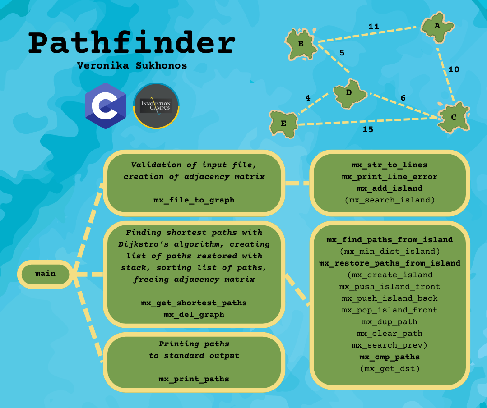

<h1 align="center">Pathfinder</h1>

<p><b>Date:</b> October 2024.</p>
<p><b>Pathfinder</b> is a program in C that finds all the shortest paths between all the islands, using information about the bridges which connect them. The project was developed during Track C, the second stage of the <a href="https://campus.kpi.kharkov.ua/en/"><b>Innovation Campus</b></a> educational program.</p>

<p><b>The program:</b></p>
<ul>
<li>reads data from a file specified as a command-line argument;</li>
<li>finds all the shortest paths between each combination of two islands using the Dijkstra’s algorithm;</li>
<li>prints the paths using the FIFO rule for the islands to the stdout.</li>
</ul>



> Note that not all used functions are shown here, but only those developed specifically for Pathfinder. The program uses many functions from my library <a href="https://github.com/VeronikaSukhonos/libmx"><b>Libmx</b></a>, developed in the previous assignment.

<h2 align="center">Installation</h2>

To compile the program, clone the repository, navigate to the project directory, initialize and update `libmx` submodule and build the project using `make` command.

```bash
git clone https://github.com/VeronikaSukhonos/pathfinder
cd pathfinder
git submodule update --init
make
```

This will first compile a static library `libmx` in its directory and then create an executable binary file `pathfinder` in the project directory.

<h2 align="center">Usage</h2>

<h3 id="input-file">Input file:</h3>

The first line is the number of islands, and remaining lines describe the distance between the two islands, one per line, in a format:

```
island1-island2,length_of_bridge\n
```

<p><b>Note that:</b></p>

* the names of the islands must contain only alphabetic characters, cannot be empty or identical;
* the first line and the length of the bridge must contain only digits (a positive value) and cannot be empty;
* the sum of the lengths of all bridges must not exceed `INT_MAX`

<h3>Running the program:</h3>

```bash
./pathfinder [filename]
```

<h3>Example input:</h3>

```
5
A-B,11
A-C,10
B-D,5
C-D,6
C-E,15
D-E,4
```

<h3>Example output:</h3>

```
========================================
Path: A -> B
Route: A -> B
Distance: 11
========================================
========================================
Path: A -> C
Route: A -> C
Distance: 10
========================================
========================================
Path: A -> D
Route: A -> B -> D
Distance: 11 + 5 = 16
========================================
========================================
Path: A -> D
Route: A -> C -> D
Distance: 10 + 6 = 16
========================================
========================================
Path: A -> E
Route: A -> B -> D -> E
Distance: 11 + 5 + 4 = 20
========================================
========================================
Path: A -> E
Route: A -> C -> D -> E
Distance: 10 + 6 + 4 = 20
========================================
========================================
Path: B -> C
Route: B -> D -> C
Distance: 5 + 6 = 11
========================================
========================================
Path: B -> D
Route: B -> D
Distance: 5
========================================
========================================
Path: B -> E
Route: B -> D -> E
Distance: 5 + 4 = 9
========================================
========================================
Path: C -> D
Route: C -> D
Distance: 6
========================================
========================================
Path: C -> E
Route: C -> D -> E
Distance: 6 + 4 = 10
========================================
========================================
Path: D -> E
Route: D -> E
Distance: 4
========================================
```

<details>
<summary><b>Possible errors</b></summary>

<p><b>You may get the following errors if:</b></p>

* there is an invalid number of command-line arguments

```
usage: ./pathfinder [filename]
```

* the file does not exist or it is empty

```
error: file [filename] does not exist
```

```
error: file [filename] is empty
```

* one of the lines does not match the [format](#input-file)

```
error: line [line_number] is not valid
```

* the number from the first line does not match with the real number of islands

```
error: invalid number of islands
```

* there is more than one bridge between the islands

```
error: duplicate bridges
```

* the sum of the lengths of all bridges in the file exceeds `INT_MAX`

```
error: sum of bridges lengths is too big
```

</details>

<h2 align="center">License</h2>
<p>The project is licensed under the terms of the <b>MIT license</b>. See the <a href="./LICENSE"><b>LICENSE</b></a> file for details.</p>
